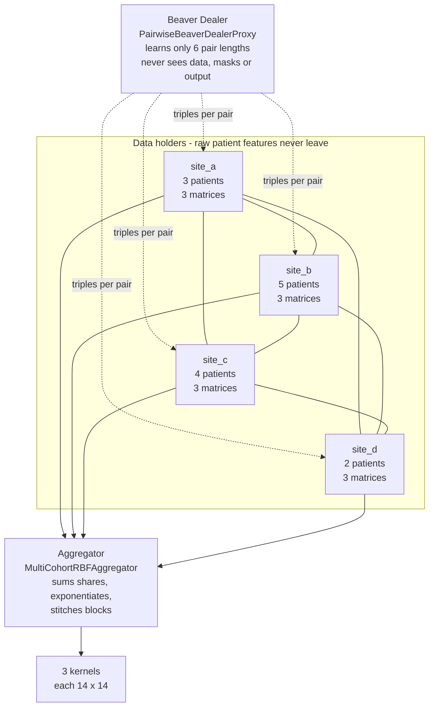
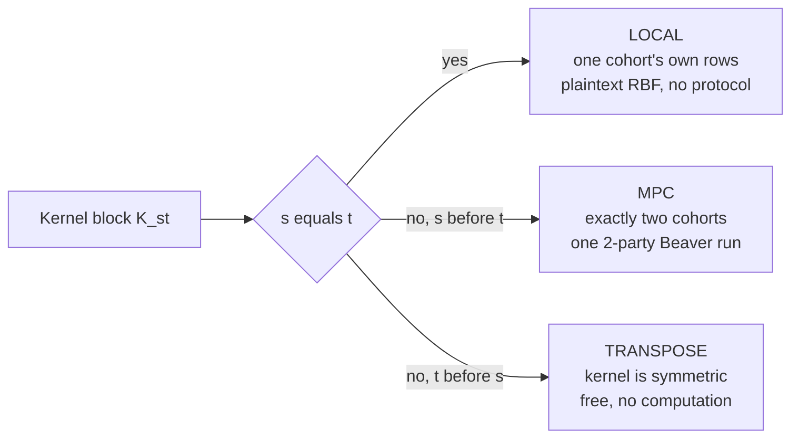
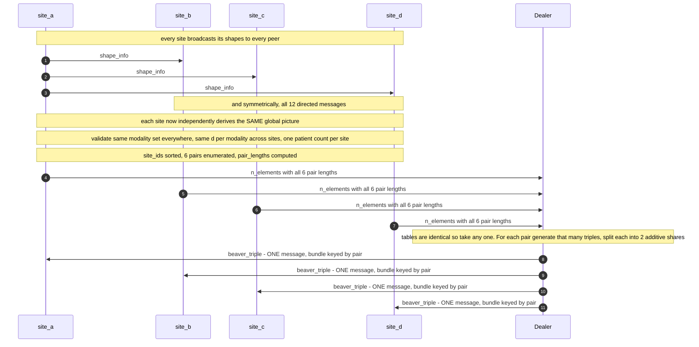
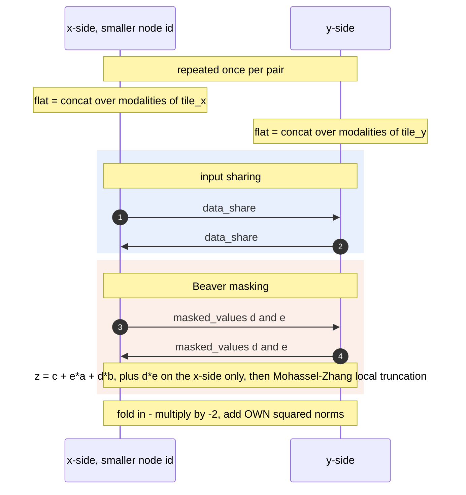
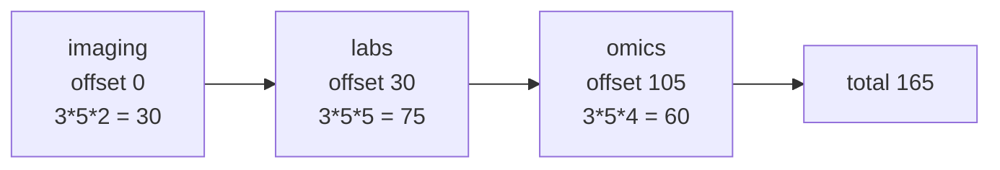
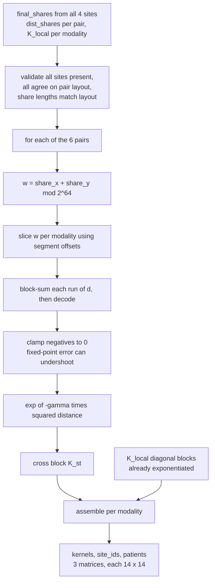
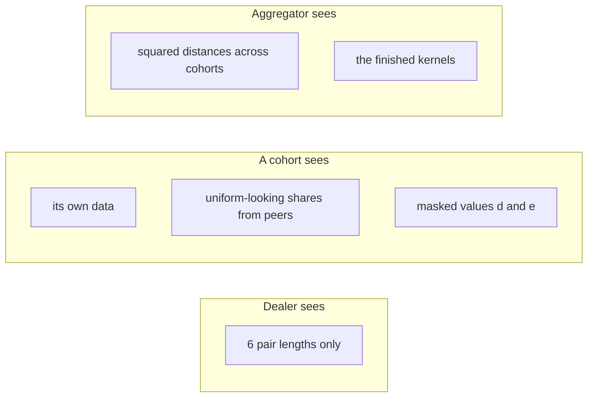

# Multi-Cohort RBF Kernels — Evaluation Flow

How `mpc_rbf_proxy_multicohort.py` gets from raw per-site matrices to one finished
kernel per modality, without any cohort seeing another's data.

Everything below uses the worked example from the file's `__main__`:

| | |
|---|---|
| **Cohorts** | 4 — `site_a` 3 patients, `site_b` 5, `site_c` 4, `site_d` 2 → **N = 14** |
| **Modalities** | 3 — `imaging` d=2, `labs` d=5, `omics` d=4 → Σd = 11 |
| **Pairs** | 6 |
| **Output** | 3 kernels, each 14 × 14, sharing identical axes |

---

## 0. The cast



The six lines between cohorts are the six **peer-to-peer** Beaver exchanges. They
never pass through the dealer. The dealer's only input is a table of six integers.

---

## 1. Why this is six 2-party problems, not one 4-party problem

The joint kernel is a 4 × 4 block matrix. Look at where each block's data comes from:

Rows and columns are grouped by cohort, so each cell below is a whole block:

| | **site_a** | **site_b** | **site_c** | **site_d** |
|---|---|---|---|---|
| **site_a** | `LOCAL` | `MPC` | `MPC` | `MPC` |
| **site_b** | transpose | `LOCAL` | `MPC` | `MPC` |
| **site_c** | transpose | transpose | `LOCAL` | `MPC` |
| **site_d** | transpose | transpose | transpose | `LOCAL` |

Where the work goes:



- **Diagonal blocks** need only one cohort's own rows → computed in the clear, locally.
- **Off-diagonal blocks** touch exactly **two** cohorts → a 2-party secure computation.
- **Lower triangle** is the transpose of the upper — the kernel is symmetric, so it is free.

No block ever mixes three cohorts. That is the whole reason no new cryptography is
needed: `beaver_multiply`, and in particular the Mohassel–Zhang `_local_truncate`,
implement a strictly **2-party** protocol. It is reused unchanged, six times.

Accounting for the 14 × 14 = 196 entries per modality:

| source | entries |
|---|---|
| diagonal blocks, computed locally in the clear | 3² + 5² + 4² + 2² = **54** |
| off-diagonal, from 71 secure patient-pairs, mirrored | 71 × 2 = **142** |

---

## 2. Round 0 — agree on a layout, order the triples



Three things are load-bearing here.

**No coordinator.** Every site derives `site_ids`, the pair list, and the block layout
from the same broadcast data using the same sorted ordering. They agree by
construction rather than by negotiation.

**The patient-count check.** Row *i* must be patient *i* in every modality at a site, so
all modalities there must report the same row count. This is what makes the three
kernels come out with identical axes and therefore combinable downstream. Cohorts
may still differ from each other.

**The dealer sends one message, not six.** `await_intermediate_data` keeps only the
newest message per sender-and-category pair, so six separate `beaver_triple` messages
would silently collapse to the last one. Bundling them into a single dict avoids this.

### Triples ordered, for the example

| pair | patients | × Σd | triples |
|---|---|---|---|
| a–d | 3 × 2 = 6 | 11 | 66 |
| a–c | 3 × 4 = 12 | 11 | 132 |
| a–b | 3 × 5 = 15 | 11 | 165 |
| d–c | 2 × 4 = 8 | 11 | 88 |
| d–b | 2 × 5 = 10 | 11 | 110 |
| c–b | 4 × 5 = 20 | 11 | 220 |
| | | | **781** |

---

## 3. Round 1 — one Beaver exchange per pair

Each site walks the global pair list in sorted order and skips pairs it is not in.
`site_a` therefore runs three exchanges; every site runs `S-1 = 3`.



The two peer categories need no per-pair scoping. `await_messages` filters on sender
and preserves everyone else's traffic, and each unordered pair exists once, so no
sender/receiver/category combination ever repeats.

### The flat vector for one pair

Modalities are concatenated into a single vector so the pair needs only one Beaver
exchange. For pair a–b, with 3 × 5 patients:



Inside one modality segment, block `i,j` starts at `offset + i*n_y + j` times `d` and
runs for `d` elements — the same tiling the 2-cohort file uses, shifted by the
segment offset.

### The fold-in

Rather than shipping squared norms to the aggregator, each side folds them into its
share. Both operations are linear, so they are free on additive shares:

```
w_i  =  -2 * z_i        then add encode of own norms into each block
```

Summing the two sides' shares over a `d`-run gives

```
-2*dot[i,j] + norm_x[i] + norm_y[j]  =  squared distance between X_i and Y_j
```

The aggregator reconstructs the distance directly and never sees either cohort's
norms — which matters because the RBF is translation invariant, so the norms would
have revealed absolute position that the kernel itself hides.

---

## 4. Assembly — from shares to three kernels



Assembly walks `site_ids` in sorted order for both rows and columns. For block `s,t`
it takes the local block when `s == t`, the reconstructed cross block when the pair
was computed as `s,t`, and the transpose otherwise.

Because every modality now shares one set of axes, the axis metadata — `site_ids` and
`patients` — is returned **once** at the top level rather than repeated per kernel.

---

## 5. What each party learns



| party | can reconstruct | cannot |
|---|---|---|
| Dealer | the 6 pair lengths | any data, mask, or output |
| Cohort | its own rows | peers' rows — shares are uniform in the ring |
| Aggregator | the kernels, and geometry up to a rigid motion | absolute positions, raw features |

The aggregator's residual knowledge is inherent to producing a plaintext kernel:
from a full distance matrix, classical MDS recovers the point configuration up to
rotation, reflection and translation. Closing that would mean keeping the kernel
secret-shared and approximating `exp` inside MPC.

---

## 6. Cost

| quantity | scaling | example |
|---|---|---|
| pairs | S(S−1)/2 | 6 |
| triples | Σ over pairs, Σ over modalities of n_s·n_t·d | 781 |
| peer round trips per site | 2(S−1) | 6 |
| dealer messages | S, one bundle each | 4 |
| rounds | 2, independent of S and of modality count | 2 |

Triples grow quadratically in the number of sites. Rounds do not — adding cohorts or
modalities never adds a round trip to the protocol's depth.

---

## Running it

```bash
python mpc_rbf_proxy_multicohort.py
```

Verifies all three kernels against a plaintext `rbf_kernel_matrix` over the stacked
cohorts, asserts they share axes, and demonstrates a weighted-sum combination.
