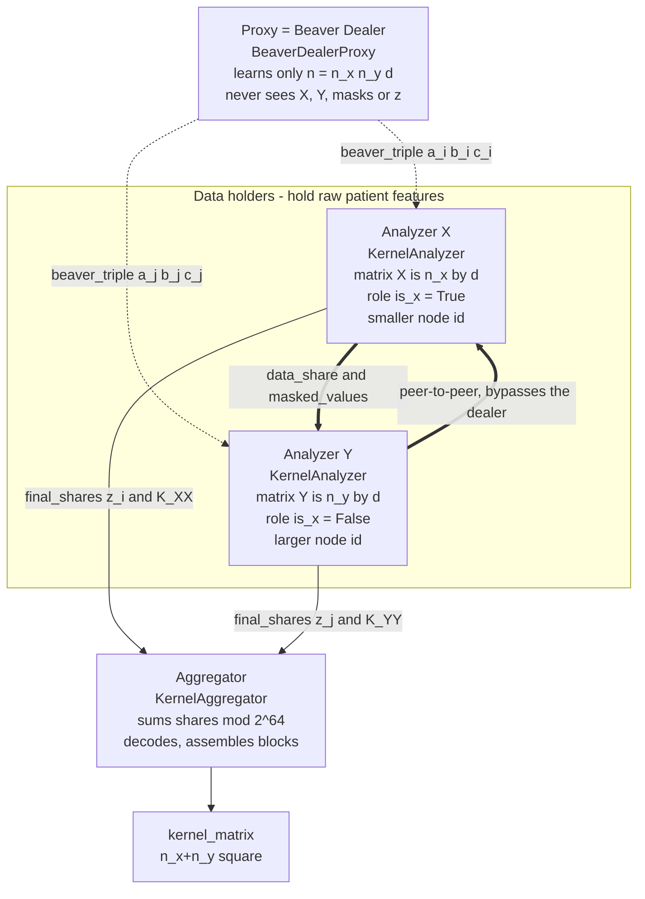
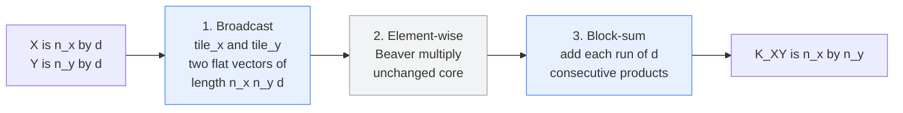
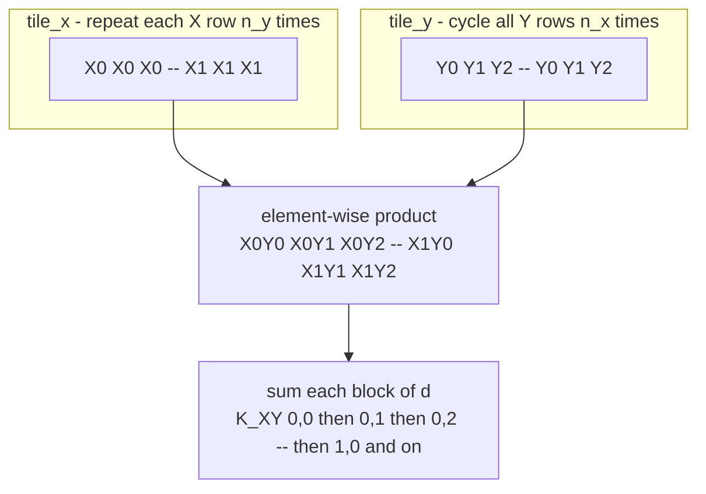
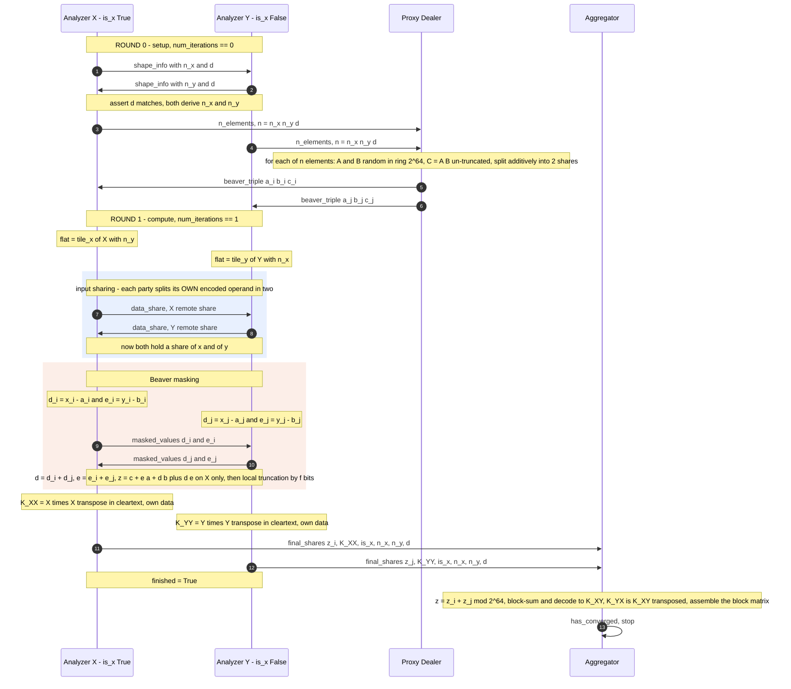
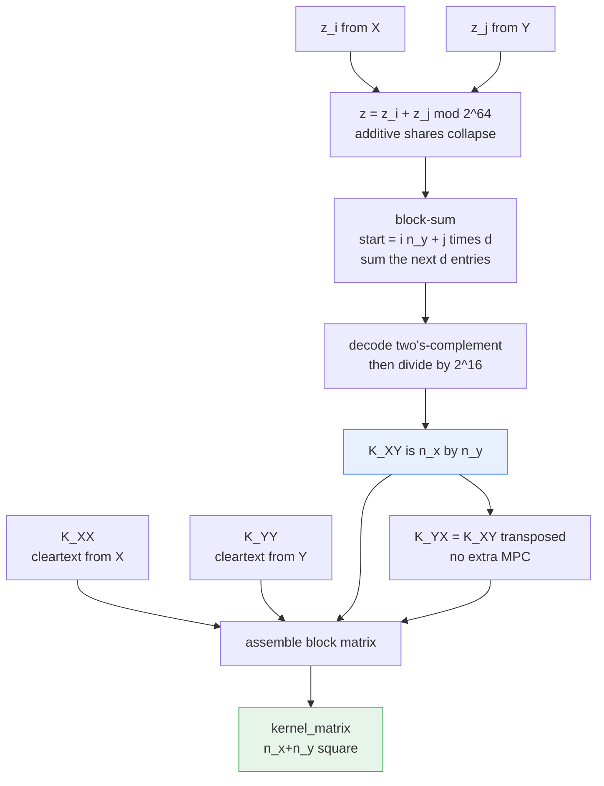
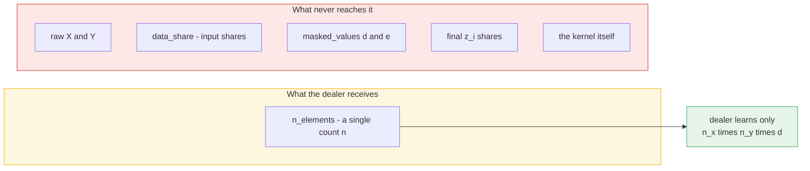
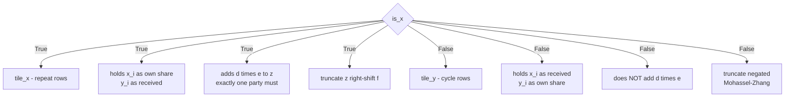

# Proxy-Dealer Setup for the Pairwise Dot-Product Kernel

How `mpc_dot_proxy.py` + `mpc_core.py` compute the full kernel matrix

```
        ┌ K_XX  K_XY ┐
    K = │            │        K_XY[i,j] = X_i · Y_j
        └ K_YX  K_YY ┘
```

across **two cohorts that never see each other's data**, using a FLAME proxy node
as a **trusted Beaver-triple dealer**.

---

## 1. The cast



**Key structural point:** the FLAME `ProxyModel` pattern normally relays
`analyzers → proxy → aggregator`. Here that relay path carries **nothing** — every
`analysis_method` returns `None`. All real traffic goes over explicit side channels
identified by `message_category`, so the dealer is architecturally in the middle but
cryptographically on the sidelines.

---

## 2. Why a kernel needs more than an element-wise multiply

`K[i,j] = X_i · Y_j` is a *contraction*, not a Hadamard product. The Beaver core only
knows how to multiply two flat vectors element-wise, so the kernel adds exactly two
pieces of logic on top:



Only the blue boxes are kernel-specific. Triples, masking and truncation are reused
verbatim from `mpc_mul_proxy.py`.

### The tiling layout

Both sides agree on one flat index ordering, so that position
`(i·n_y + j)·d + k` holds `X[i][k]` on one side and `Y[j][k]` on the other:



*(example with n_x = 2, n_y = 3; each symbol above is a length-`d` run)*

---

## 3. Full protocol flow — 2 rounds



---

## 4. Aggregator reconstruction



Only the **off-diagonal** block `K_XY` costs an MPC protocol. The diagonal blocks are
each computed locally in the clear — a cohort learns nothing new by taking inner
products within its own data.

---

## 5. Why the dealer is safe



| Node | Sees | Cannot reconstruct |
|---|---|---|
| Dealer (proxy) | the element count `n` | inputs, masked values, output |
| Analyzer X | own `X`, one additive share of `Y`, masked `d`/`e` | `Y` (shares are uniform in the ring) |
| Analyzer Y | own `Y`, one additive share of `X`, masked `d`/`e` | `X` |
| Aggregator | both `z` shares → the kernel | the raw feature matrices |

The masked values `d = x − a` and `e = y − b` are uniformly random to each party because
`a` and `b` are fresh, uniform, and known only in shares — that is exactly the Beaver
guarantee. The dealer is the only entity that ever knows `A` and `B` in the clear, and it
never sees `d` or `e`, so it cannot invert the mask.

---

## 6. Implementation details worth knowing

**Role assignment is by node id.** `is_x = self.id < partner_id`. The cohort with the
smaller id becomes the "x side". Which physical cohort that is varies per run, which is
why the `__main__` harness reorders its plaintext reference with
`X_, Y_ = (Xa, Ya) if result["n_x"] == N_X else (Ya, Xa)`.

**`is_x` drives three asymmetries:**



**Truncation is applied to `z`, not baked into the triple.** The dealer stores
`C = A·B` un-truncated on purpose; each party truncates its own `z_i` at the end. The
two-party Mohassel–Zhang scheme is correct up to a small probability of a large error
and introduces ±1 ulp noise — hence the `atol=0.05` tolerance in the self-test rather
than exact equality.

**Fixed point:** ring `2^64`, `PRECISION_BITS = 16`. Feature values must stay well
inside the ring after the `d`-term accumulation, or products wrap around silently.

**Round dispatch is by `self.num_iterations`.** Round 0 does shape exchange + triple
request; round 1 does the multiply. `has_converged` returns `True` at
`num_iterations >= 1`, and analyzers set `self.finished = True` to leave the loop.

---

## 7. Known limitations

- **Hard-wired to 2 analyzers.** `partner_analyzer_id()` picks `others[0]`, so a third
  cohort breaks the pairing. Generalizing means pairing `i → i+1` cyclically.
- **Message categories are global.** With several pairs exchanging at once,
  `beaver_triple` / `masked_values` would collide across pairs. Each pair needs its own
  channel before scaling past two cohorts.
- **The dealer is trusted.** It knows `A` and `B`; a dealer colluding with either
  analyzer breaks privacy. Replacing it with OT- or HE-based triple generation removes
  that assumption.

---

## Running it

```bash
python mpc_dot_proxy.py   # kernel, verified against a plaintext np.block
python mpc_mul_proxy.py   # the element-wise multiply this was built from
```

Requires the `proxy-nodes` branch of `python-sdk-patterns` (`flame.proxy` does not
exist on `main`), and `num_proxy_nodes=1`.
